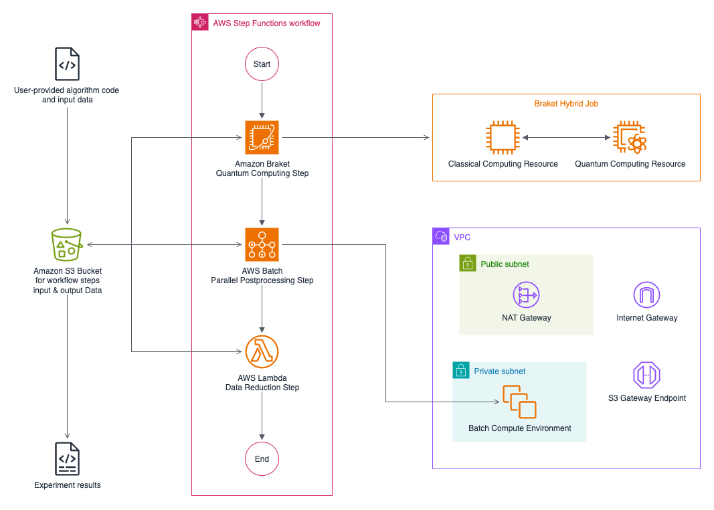
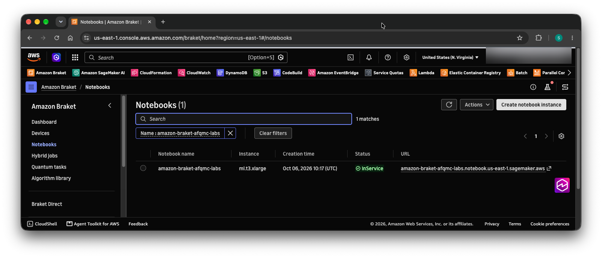
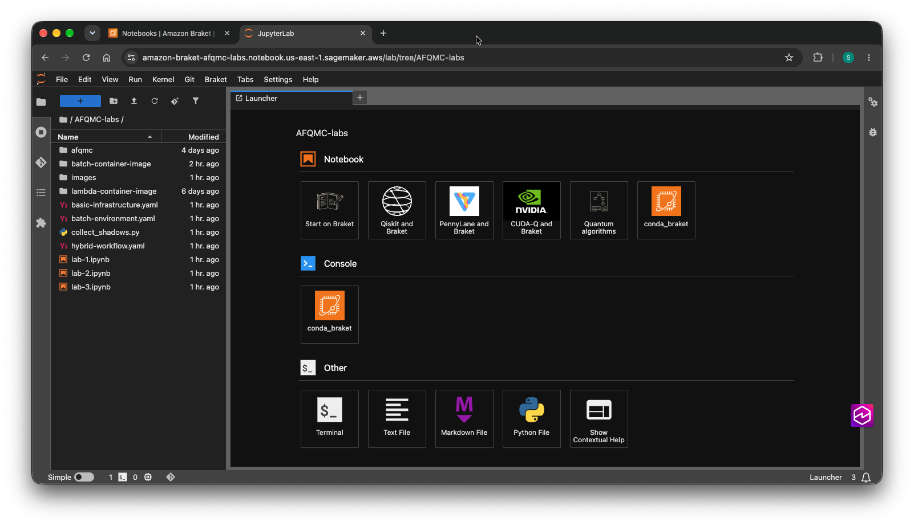
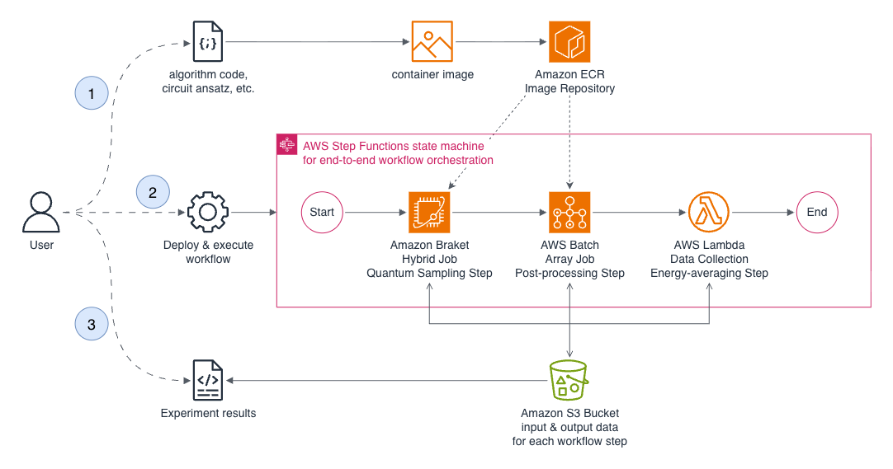

# Sample Integration of Amazon Braket and AWS Batch for Hybrid Quantum-Classical Workflows

> ⚠️ **IMPORTANT DISCLAIMER**
>
> This is sample code for educational and demonstration purposes.
> This code is NOT intended for production use without additional security,
> performance, and reliability considerations.
>
> **Before deploying to production:**
> - Work with your security and legal teams to meet your organizational
>   security, regulatory, and compliance requirements
> - Conduct thorough security reviews and testing
> - Implement appropriate monitoring, logging, and error handling
> - Follow your organization's deployment and change management processes
>
> **Security Notice:** This sample code may not include all security best
> practices required for production environments. Additional security measures
> may be necessary based on your specific use case and regulatory requirements.

Classical Quantum Monte Carlo (QMC) methods leverage high-performance computing (HPC) resources to simulate complex quantum many-body systems. Recently, these methods have been extended to quantum computers (QC) in hopes to achieve better accuracy. At the same time, architectures are being developed that enable such hybrid workflows by integrating quantum and HPC resources often hosted at different locations. In this tutorial, we demonstrate a solution to an exemplary quantum many-body problem integrating distributed classical and quantum computing systems in the cloud. Specifically, we build an end-to-end workflow to execute the subroutines of a QMC algorithm on AWS Batch and Amazon Braket resources and estimate the ground state energy of the example problem Hamiltonian. In this cloud-native solution we use AWS Step Functions for the workflow orchestration of the integrated  quantum-classical compute pipeline and apply it to the QC-AFQMC algorithm as a practical example. The solution can be readily adapted to other hybrid algorithms that share a similar workflow pattern.

## Solution Architecture

The QC-AFQMC workflow consists of three steps: an initial quantum sampling step, a large parallel classical post-processing step, and a small final energy-averaging step. We map each step to an AWS service whose execution model fits naturally:

* Quantum sampling: The collection of shadow data involves the evaluation of a high volume of quantum circuits. We run this workload as an Amazon Braket Hybrid Job which allocates QPU or circuit simulator resources alongside the classical resources that drive quantum program execution and combines the shadow tomography measurements in a self-contained way. The job is created conveniently with a single API call, resources are automatically allocated and released, and the collected shadow data is stored durably in a bucket on Amazon S3.
* Classical post-processing: We propose to run the embarrassingly parallelizable evolution of thousands of independent Monte Carlo walkers as an array job on AWS Batch. The job is submitted with a single API call, the service launches one task per walker across many compute nodes and automatically scales the compute fleet on demand. Each array task reads the shadow data from S3, evolves a single walker, and writes partial results (the walkers’ local energies) back to S3.
* Energy averaging: We use a lightweight AWS Lambda function to gather the per-walker local energies stored on S3, compute their weighted average, yielding the final estimate of the ground-state energy, and store it in the S3 bucket.

* With the above service choices, the three steps are effectively decoupled, can allocate and release the computing resources they require, and scale independently, each launched with a single service API call. Instead of tying the steps together with a custom script and manual polling, we use AWS Step Functions for automated end-to-end workflow orchestration. The QC-AFQMC workflow is modeled as a state machine (see figure below), which invokes the steps in sequence, starting each step once the previous has completed and passing a reference to the intermediate results stored in S3. Workflow tracking, monitoring, and error handling to catch and retry failed steps are provided by the service.

## Prerequisites

To run the AFQMC labs you need access to an [AWS account](https://docs.aws.amazon.com/accounts/latest/reference/accounts-welcome.html) with administrative permissions to create the AWS resources described in [`basic-infrastructure.yaml`](./basic-infrastructure.yaml).

We recommend you use the [AWS region](https://docs.aws.amazon.com/global-infrastructure/latest/regions/aws-regions.html) US East (N. Virginia), `us-east-1` for these labs.

## Basic Setup

Before you can start with the actual labs, you have to prepare basic infrastructure in your AWS account.
Log in to your account, go to the [AWS CloudFormation management console](https://us-east-1.console.aws.amazon.com/cloudformation/home?region=us-east-1#/stacks) and create a stack from the template `basic-infrastructure.yaml`. **Name the stack `AFQMC-labs-infrastructure`.**

Review the AWS CloudFormation user guide to learn how to [create a stack from the CloudFormation console](https://docs.aws.amazon.com/AWSCloudFormation/latest/UserGuide/cfn-console-create-stack.html).

The stack will deploy basic Amazon VPC and AWS IAM resources, as well as an Amazon Braket Notebook instance you can use as your isolated development environment for the AFQMC labs.

Creation of the stack may take about 10 minutes. Once completed, go to the notebooks page on the [Amazon Braket management console](https://us-east-1.console.aws.amazon.com/braket/home?region=us-east-1#/notebooks) where you will find a notebook instance named "amazon-braket-afqmc-labs" with status `InService`. Click on the presigned login URL to enter the Jupyter lab environment.

## Run the labs

The sample code is already cloned into your Jupyter lab environment. You find it in the directory `AFQMC-labs` in the file browser and under `/home/ec2-user/SageMaker/AFQMC-labs` in a terminal window.

Now, you are set up to run the AFQMC labs. The labs are split up into three Jupyter notebooks with all descriptions, code, and references you need to run the classical and quantum-classical variants of the AFQMC workflow end-to-end.
* In `lab-1.ipynb` you will create the AWS Batch compute environment for parallel Monte Carlo walker propagation. In this lab you will also run classical AFQMC jobs on AWS Batch.
* In `lab-2.ipynb` you will run the steps of the hybrid quantum-classical AFQMC workflow individually. You will perform shadow tomography on Amazon Braket and use the collected shadow data in the AFQMC walker propagation on AWS Batch.
* In `lab-3.ipynb` you will tie the steps together in a fully integrated workflow orchestrated with AWS Step Functions.

You will learn how to containerize the application code and push the images to repositories in a private Amazon ECR container registry. You will deploy your integrated Step Functions workflow and execute it end-to-end by means on an API call. The data representing intermediate and final results of each step in the workflow are stored durably in a bucket on Amazon S3 and passed to the steps by reference.

## Clean up

After you are done with the labs you should clean up all resources that have been created in your account.
You may run the script `teardown.sh` from an environment that has programmatic access to your account (e.g. with [CloudShell](https://docs.aws.amazon.com/cloudshell/latest/userguide/welcome.html)), or follow the steps in the script and execute them manually in the console:
* Empty both ECR repositions
* Empty the S3 data bucket
* Delete the three CloudFormation stacks in reverse creation order (`braket-batch-workflow` → `batch-environment` → `AFQMC-labs-infrastructure`)

## AWS resource costs for running the labs

Deploying this project will incur AWS charges for Amazon EC2, Amazon Braket, and related resources.

| Resource type                   | Comments                                                                                                                                                                                                                                                                                                                                                                                                                                                                                                                                                                                                                                                                                                                                                       | Cost estimate |
|---------------------------------|----------------------------------------------------------------------------------------------------------------------------------------------------------------------------------------------------------------------------------------------------------------------------------------------------------------------------------------------------------------------------------------------------------------------------------------------------------------------------------------------------------------------------------------------------------------------------------------------------------------------------------------------------------------------------------------------------------------------------------------------------------------|---------------|
| Amazon Braket notebook instance | An instance of type `ml.t3.xlarge` used as development enironment and hosting the lab notebooks runs from "AFQMC-labs-infrastructure" stack creation to deletion. On demand price for the notebook instance: 0.20 USD per hour. Assumed duration: 2 hours.                                                                                                                                                                                                                                                                                                                                                                                                                                                                                                     | 0.40 USD      |
| Amazon Braket Hybrid Jobs       | Two hybrid jobs are ran  in lab 2 and 3. Each hybrid job run for approx. 10 minutes on a `ml.m5.large` job instance and creates 4000 quantum tasks on SV1. The job instance price is 0.00192 USD per minute. The price for one of the SV1 tasks in the labs is 0.00375 USD.                                                                                                                                                                                                                                                                                                                                                                                                                                                                                    | 30.04 USD     |
| AWS Batch jobs                  | Four jobs are ran across labs 1, 2, and 3 on compute-optimized EC2 instances (e.g. c6i/c7i/c8i instance families): One small-scale classical AFQMC job (1 walker, 200 time steps, duration <1 minute per walker, 2 vCPUs per walker), one large-scale classical AFQMC job (1000 walkers, 600 time steps, duration ~ 1 minute per walker, 2 vCPUs per walker), one medium-scale quantum AFQMC job (400 walkers, 200 time steps, duration ~7 minutes per walker, 2 vCPUs per walker) and one larage-scale quantum AFQMC job (1000 walkers, 600 time steps, duration ~20 minute per walker, 2 vCPUs per walker). All jobs add up to 794 vCPU-hours. For a `c6i.32xlarge` (128 vCPUs, 5.44 USD per hour) instance we estimate a price of 0.0425 USD per vCPU-hour. | 33.75 USD     |
| **Total estimate for compute**  | *Additional resource costs for data storage, transfer, and other services we estimate negligible compared to the cost of compute.*                                                                                                                                                                                                                                                                                                                                                                                                                                                                                                                                                                                                                             | **65 USD**    |
